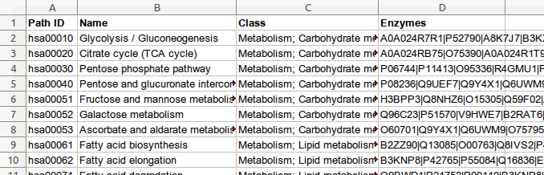

% Data processing for metabolic pathways using files, web services and databases
% João D. Ferreira; Francisco M. Couto
% August 2016

# Table of contents

- [Introduction](#introduction)
- [Module 1 -- Metabolic pathways data](module1.xSpnKKsf.html)
- [Module 2 -- Simple selection and saving data on disk](module2.1ze59Jg6.html)
- [Module 3 -- UniProt as a web service](module3.brjM6OTI.html)
- [Module 4 -- Crossing data from several sources](module4.wA7dhLqP.html)
- [Module 5 -- Information selection with regular expressions](module5.jPQ8bPvi.html)

# Introduction

The aim of these exercises is to provide students the ability and competence to process data in an automatic fashion.
The main topic surrounding these exercises will be metabolic pathway data processing, with a closer focus on the proteins that catalyse the chemical reaction those pathways, also known as _enzymes_.
Despite working with metabolic pathways during the classes, the data processing methods that the students will learn in this class can be applied to many other types of data.

## Data

The following figure represents the first steps in the glycolysis, a metabolic pathway that decomposes glucose in smaller chemical compounds.
This figure includes a representation of five steps in this pathway, each one catalysed by a different enzyme.

For this class, we will provide [an Excel file](files/metabolic_pathways.xls) with information on 297 metabolic pathways.
Each line in this file contains:

- an identifier of the metabolic pathway;
- the name of the pathway;
- the class it belongs to;
- a list of the enzymes that participate in the pathway.

Therefore, the Excel file has 297 lines, plus another one for the column headers.

The following image shows a screenshot of the Excel file and its data

This information comes from an online database called [Kyoto Encyclopedia of Genes and Genome](http://www.genome.jp/kegg/kegg2.html). The enzymes are referred by their UniProt code.
[UniProt](http://www.uniprot.org/) is a database of proteins that contain, among a vast amount of information, the aminoacid sequences of the proteins.

## Processing

Despite the data being provided to the students as an Excel file, the data processing operations will mostly be executed with a programming language.
In this class, we will use [Python](http://www.python.org)
Processing our data with Python instead of Excel offers several benefits:

- We can define a set of operations to be executed automatically, which in Excel would take a large amount of time, since it is mostly driven by user interaction rather than direct commands
- Programming languages can handle complex data types, while Excel is mostly oriented towards numeric computations

No deep knowledge of programming will be required for the class exercises, as we will provide most of the code.
In fact, the students will not directly learn the details of Python as a programming language, but will instead be given "recipes" that contain most of the necessary logic, with small snippets of missing code that the students need to fill.
However, we expect that the students familiarize themselves with Python syntax before the first module of this class by following some online courses.
For example, [Codecademy](https://www.codecademy.com/en/tracks/python) contains six modules that will help the students in this task:

- [Python Syntax](https://www.codecademy.com/courses/introduction-to-python-6WeG3/0/1?curriculum_id=4f89dab3d788890003000096)
- [Strings & Console Output](https://www.codecademy.com/courses/python-beginner-sRXwR/0/1?curriculum_id=4f89dab3d788890003000096)
- [Conditionals & Control Flow](https://www.codecademy.com/courses/python-beginner-BxUFN/0/1?curriculum_id=4f89dab3d788890003000096)
- [Python Lists and Dictionaries](https://www.codecademy.com/courses/python-beginner-en-pwmb1/0/1?curriculum_id=4f89dab3d788890003000096)
- [File Input/Output](https://www.codecademy.com/courses/python-intermediate-en-OGNHh/0/1?curriculum_id=4f89dab3d788890003000096)

